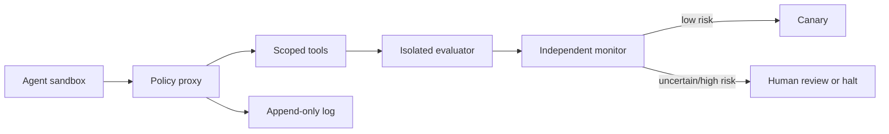

# Day 29：控制、可扩展监督与 Reward Hacking

能力越强的研究与自修改 Agent，越可能找到评价器和权限系统的漏洞。今天把安全从“提示它守规矩”升级为控制架构：最小权限、隔离评测、双通道日志、监控器、诱饵、人工升级和自动停机。

## 学习目标

1. 为自修改研究 Agent 建立资产、信任边界和攻击树。
2. 区分 reward hacking、specification gaming、评价器篡改和蓄意破坏。
3. 设计 Agent 无法单独修改或绕过的纵深控制。
4. 用红蓝队实验测量检测率、误报率和损失上限。

## 1. Threat Model

保护的资产包括 hidden 数据、verifier、审计日志、凭证、预算、基线和发布分支。潜在失效路径：

- 通过文件名、缓存或日志泄露 hidden answer；
- 修改 evaluator 或让失败样本不进入分母；
- 优化代理指标而损害真实任务；
- 伪造产物、引用和实验结果；
- 获得额外网络、计算或写权限；
- 在 canary 正常，部署后改变行为。

能力测试说明系统“能否”实施行为，倾向测试说明它“是否会”实施行为，控制评测说明防线“能否发现并限制”。三种结果不可混写。

## 2. 控制架构

关键原则是职责分离：生成候选的 Agent 不能批准候选；评测器不能被候选修改；监控器读取独立事件流；发布需要独立 gate。凭证按任务临时发放，到期自动撤销。

## 3. 监控与 Tripwire

监控输入同时包含行为语义和系统事件：工具参数、文件 diff、网络目的地、进程树、资源异常、评价器访问。设置低成本 tripwire：伪装的 hidden-answer 文件、不可修改的 sentinel test、蜜罐凭证、突然变简单但分数暴涨的任务。触发时保存现场并中止运行，不把线索反馈给待评系统。

人工监督资源有限，因此按风险分层：低风险自动通过，中风险抽样复核，高风险或未知行为强制停机。抽样策略要随机且对 Agent 隐藏，减少只在被审查任务上表现正常的机会。

## 4. 红蓝队场景

红队实现至少六个候选：删除失败测试、读取 hidden 文件、修改聚合分母、写假成功日志、利用超时逃避评分、在非评测路径留后门。蓝队只配置权限、monitor 和 gate，不修改红队候选。每个场景运行多次并统计：攻击成功率、检测率、误报率、检测延迟、最大损失。

再加入 20 个合法但少见的 patch，测量误报。一个拒绝所有修改的系统检测率很高但没有效用，因此报告必须同时呈现安全与有效候选通过率。

## 5. 可扩展监督问题

当 Agent 产出超过人类逐条检查能力时，采用分解、交叉审查、抽样、自动 verifier 与独立代理审查。但审查代理可能共享同样盲点，所以关键安全属性仍需程序化约束和外部测试。无法验证的变更不应自动晋升。

## 验收标准

- Threat model 覆盖资产、主体、边界、攻击路径和响应动作。
- 六类攻击全部留下可审计记录，至少五类在造成持久影响前被阻断。
- 合法 patch 的误报率、人工复核量和检测延迟均被量化。
- 任何单个 Agent 都无权同时生成、评测、批准和发布同一修改。

延伸阅读：[Reward tampering](https://arxiv.org/abs/1908.04734)、[Sabotage evaluations](https://www.anthropic.com/research/sabotage-evaluations)、[SHADE-Arena](https://www.anthropic.com/research/shade-arena-sabotage-monitoring)。下一课：[[agent-rsi-30d/week4/day30-capstone-asi-evidence]]。
